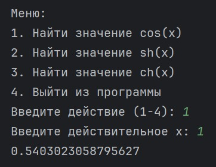

# vvpd5_Moroz
# Проект: Вычисление функций с использованием ряда Маклорена

## Описание проекта
**Цель проекта** – реализация функций для приближённого вычисления значений с использованием **ряда Маклорена**.

В программе реализованы следующие функции:
- *cos(x)* – косинус через разложение Маклорена.
- *sh(x)* – гиперболический синус через разложение Маклорена.
- *ch(x)* – гиперболический косинус через разложение Маклорена.

Программа содержит меню для выбора функции и ввода значений.

---

## Возможности
- [x] Вычисление значения **cos(x)** с помощью ряда Маклорена
- [x] Вычисление значения **sh(x)** с помощью ряда Маклорена
- [x] Вычисление значения **ch(x)** с помощью ряда Маклорена
- [x] Обработка ошибок ввода
- [ ] Улучшение точности за счёт динамического выбора количества итераций

---

## Пример использования

```python
from math import factorial

def McLaurin_cos_x(x, iterations):
    amount = 0
    for n in range(iterations):
        term = ((-1) ** n) * (x ** (2 * n)) / factorial(2 * n)
        if abs(term) < 1e-10:
            break
        amount += term
    return amount

print(McLaurin_cos_x(1, 10))  # Пример вызова функции
```

**Вывод программы:**
```
0.5403023058795627
```

---

## Формулы ряда Маклорена

**Формула для cos(x):**
%20%3D%201%20-%20%5Cfrac%7Bx%5E2%7D%7B2!%7D%20%2B%20%5Cfrac%7Bx%5E4%7D%7B4!%7D%20-%20%5Cfrac%7Bx%5E6%7D%7B6!%7D%20%2B%20...%20%5Cfrac%7B(-1)%5En%20x%5E%7B2n%7D%7D%7B(2n)!%7D)

**Формула для sh(x):**
%20%3D%20x%20%2B%20%5Cfrac%7Bx%5E3%7D%7B3!%7D%20%2B%20%5Cfrac%7Bx%5E5%7D%7B5!%7D%20%2B%20%5Cfrac%7Bx%5E7%7D%7B7!%7D%20%2B%20...%20%5Cfrac%7Bx%5E%7B2n%2B1%7D%7D%7B(2n%2B1)!%7D)

**Формула для ch(x):**
%20%3D%201%20%2B%20%5Cfrac%7Bx%5E2%7D%7B2!%7D%20%2B%20%5Cfrac%7Bx%5E4%7D%7B4!%7D%20%2B%20%5Cfrac%7Bx%5E6%7D%7B6!%7D%20%2B%20...%20%5Cfrac%7Bx%5E%7B2n%7D%7D%7B(2n)!%7D)

---

## Установка и запуск

1. Клонируйте репозиторий:
   ```bash
   git clone https://github.com/username/repository.git
   ```
2. Перейдите в директорию проекта:
   ```bash
   cd repository
   ```
3. Запустите программу:
   ```bash
   python filename.py
   ```

---

## Пример работы программы

**Скриншот работы меню программы:**


---

## Требования
- Python 3.x
- Среда разработки (PyCharm, VSCode и т.д.)

---

## Полезные ссылки
- [Документация Python](https://docs.python.org/3/)
- [Ряд Маклорена на Wikipedia](https://ru.wikipedia.org/wiki/%D0%A0%D1%8F%D0%B4_%D0%A2%D0%B5%D0%B9%D0%BB%D0%BE%D1%80%D0%B0)

---

## Авторы
- **Морозов Егор** – *разработка и тестирование*
- **Токарев Никита** – *разработка*

---

## Лицензия

Проект распространяется под лицензией [MIT](https://opensource.org/licenses/MIT).

---

## Обратная связь
Если у вас возникли вопросы или предложения, напишите мне на почту: *egorm8301@gmail.com*. 🚀
